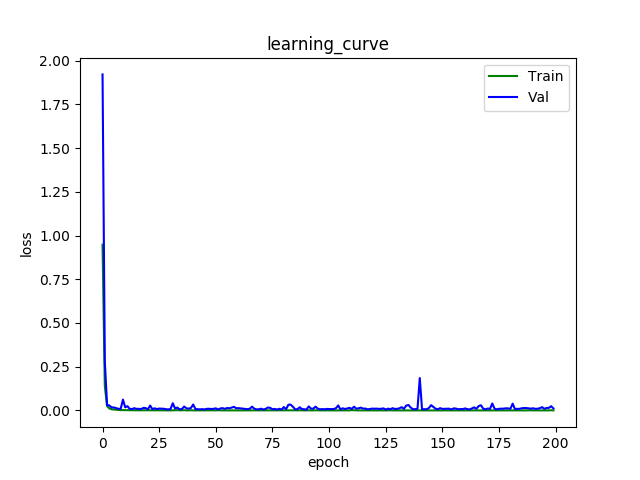

# TL_Dataset_Classification
This repo implements an end-to-end classifier in Traffic Light Dataset based on pytorch. 

# How To Run
**First**, you should clone this repo:
```bash
$ git clone https://github.com/FangYang970206/TL_Dataset_Classification
```

**Second**, download the dataset with [onedrive][1], [baiduyun][2] or [google][3]. Move the `TL_Dataset.zip` in the `TL_Dataset_Classification/`, then unzip the `TL_Dataset.zip`.

**Third**, start training.
```bash
$ python main.py
```
or(custom)
```bash
$ python main.py --img_resize_shape tuple --batch_size int --lr float --num_workers int --epochs int --val_size float --save_model bool --save_path str 
```
The val_size(defualt=0.3) is radio in whole dataset. 

# Result
learning curve:



In the testset, achieve 97.425%. (keep improving)


[1]: https://1drv.ms/u/s!AgBYzHhocQD4hD2e-EnTWbq7RpWi
[2]: https://pan.baidu.com/s/1voBHwdX2hH1p_jn4_6EhTg
[3]: https://drive.google.com/open?id=17FYVON8jNwrecqaOdzGhD1jDXk0xoiDk